<h1 align="center">AnomalyIQ</h1>

Fast, visual fraud detection for data that needs more than one signal.

  
  
  
  
  
  
  
  

AnomalyIQ is a full-stack anomaly and fraud intelligence demo that blends machine learning, rule-based signals, graph analysis, and explainable insights to surface suspicious activity and support investigations.

---

> 🚀 <b>Update</b>: More features set to release soon...

---

## Architecture

  

## Highlights

- Multiple signals combined into one risk score
- Clear explanations, charts, and narratives for every case
- Interactive workflows for upload, prediction, simulation, and investigation
- Lightweight stack with a FastAPI backend and vanilla JavaScript frontend

## Screenshots

🖥️ Upload & Training

 

| | |
|---|---|
| 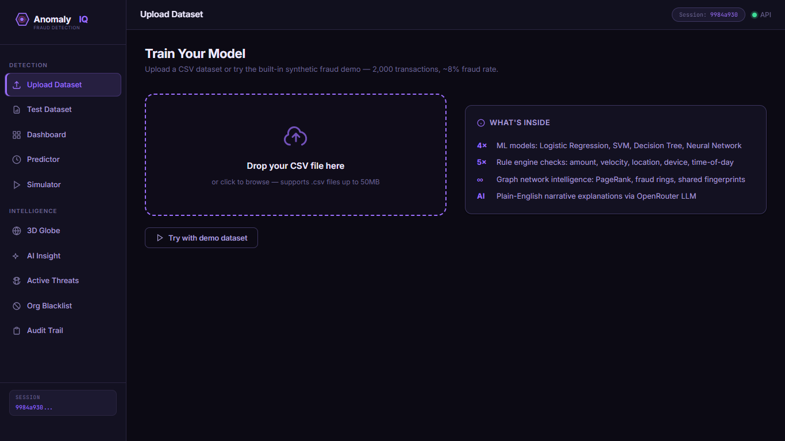 | 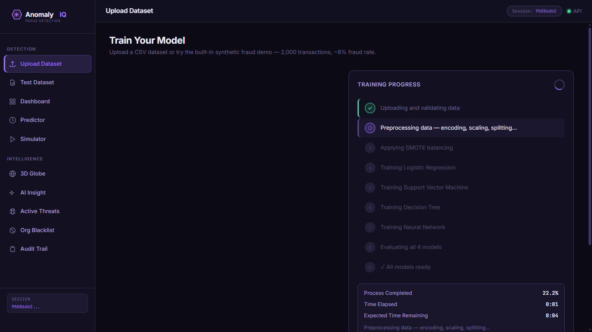 |
| 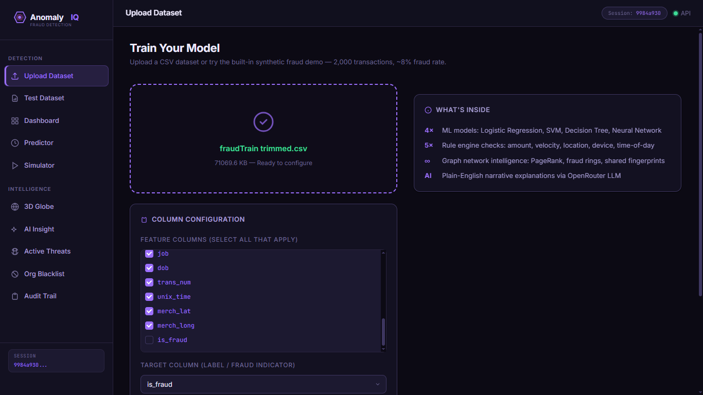 | 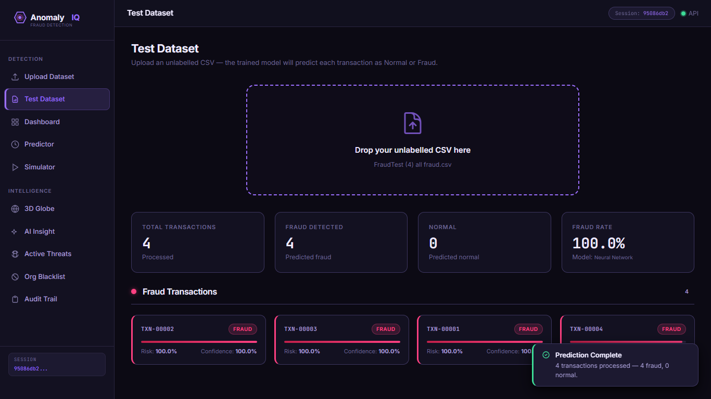 |
| 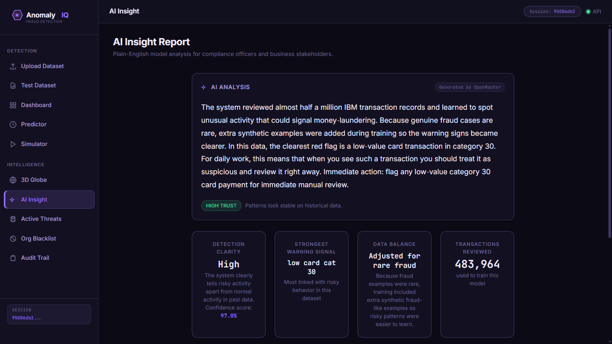 | |

📊 Analysis & Scoring

 

| | |
|---|---|
| 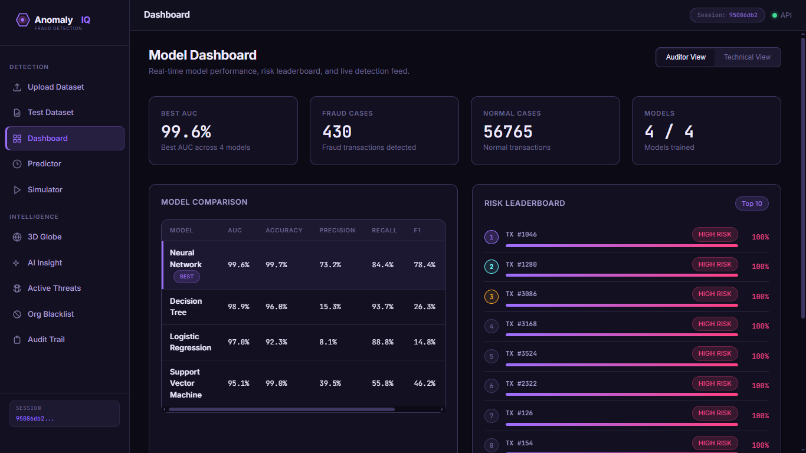 | 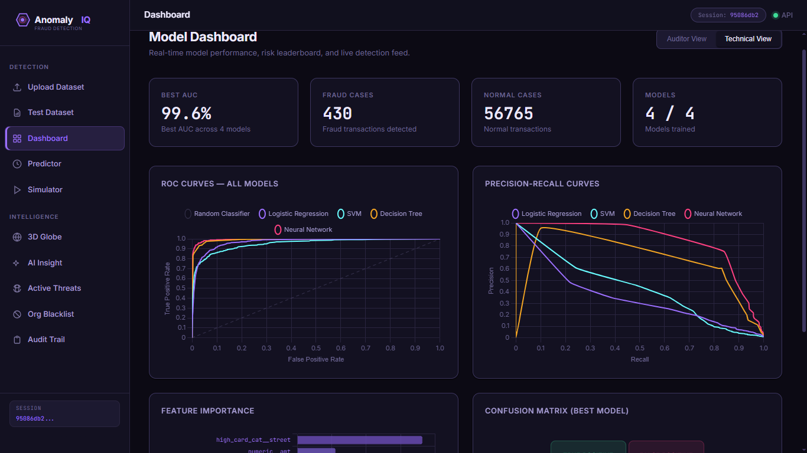 |
| 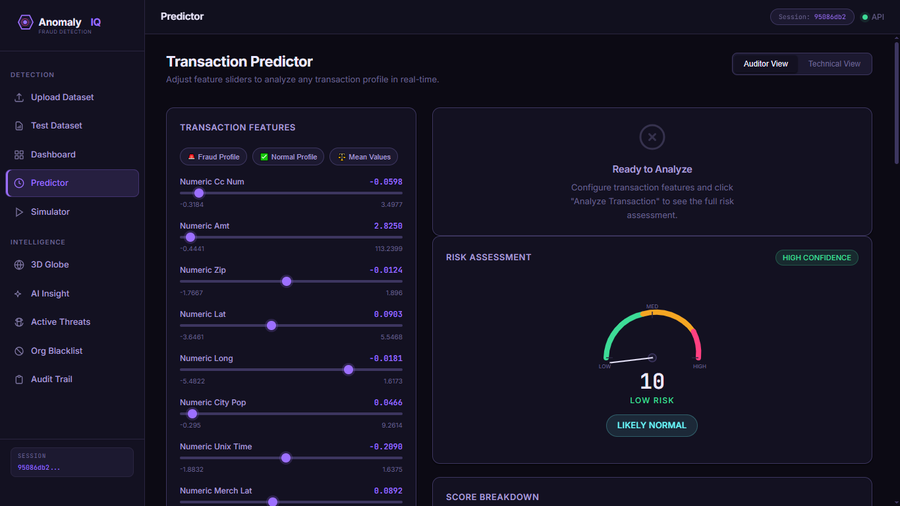 | 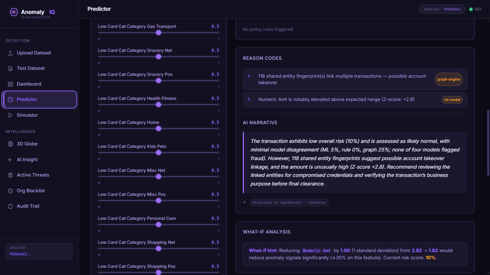 |
| 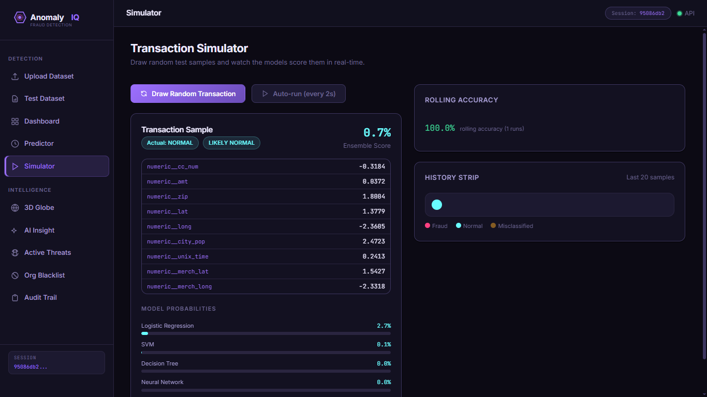 | |

🔎 Investigation & Intelligence

 

| | |
|---|---|
| 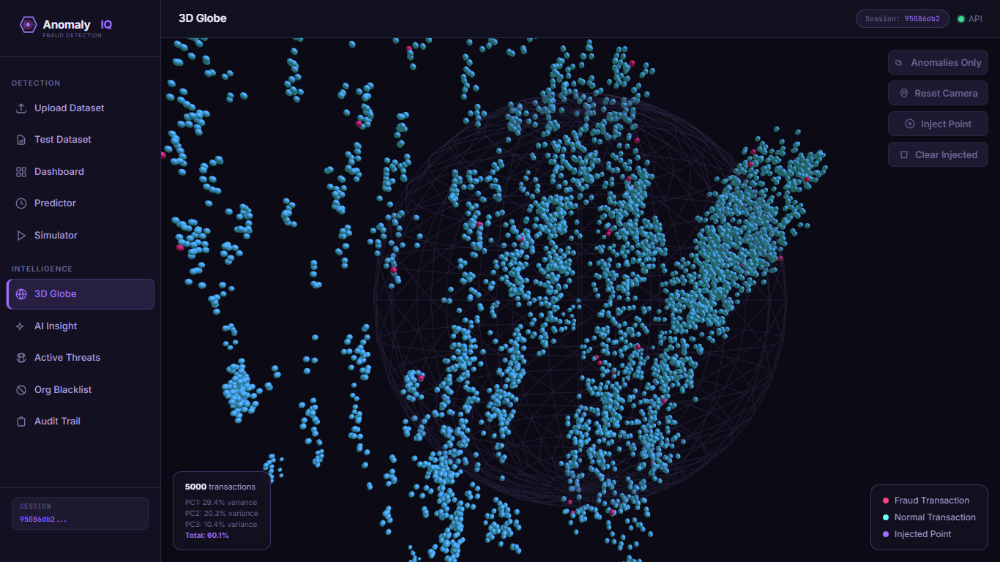 | 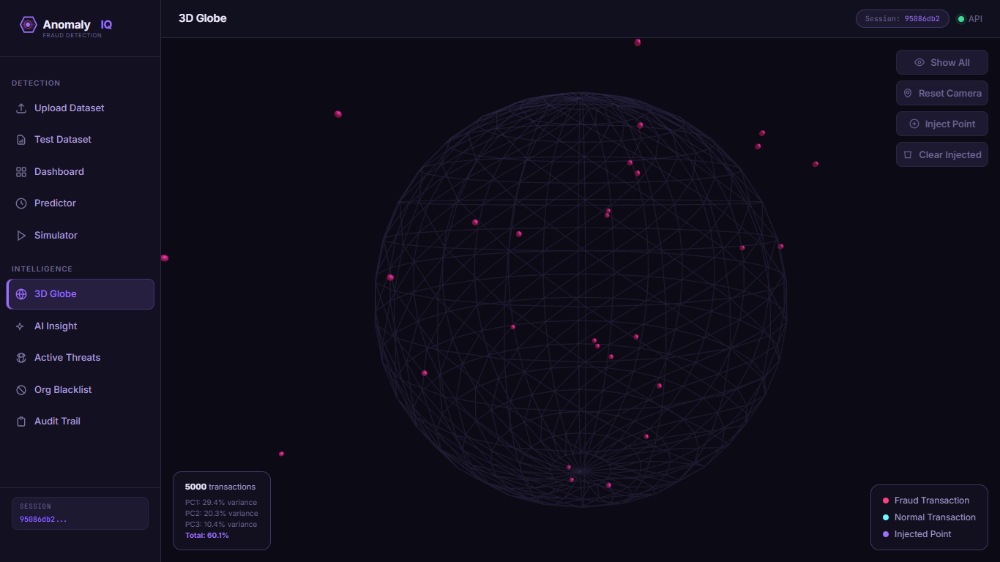 |
| 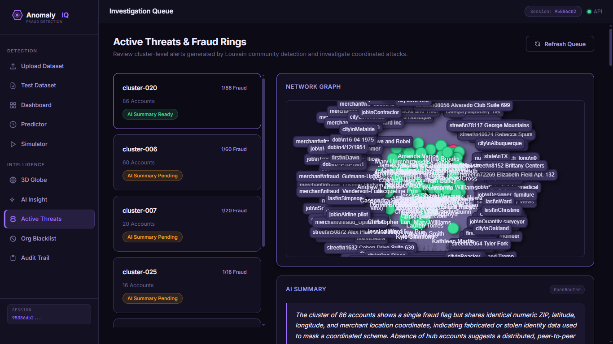 | 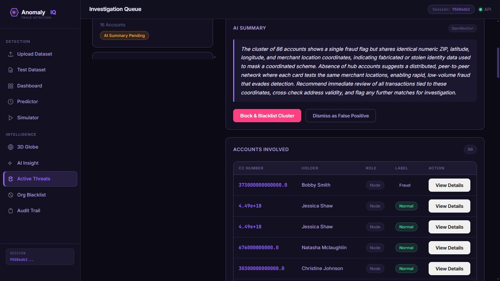 |
| 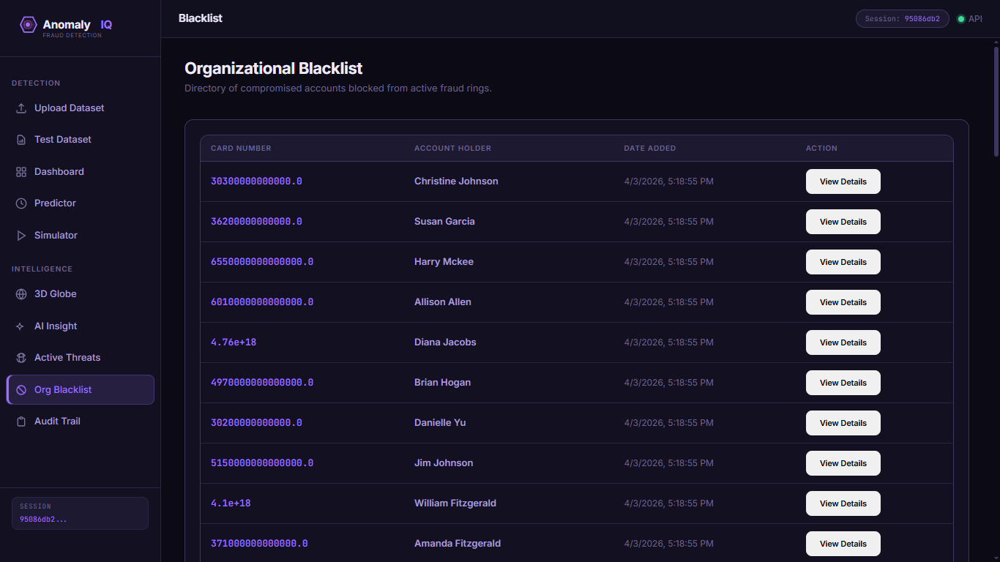 | |

---

> ⭐ If you find this project useful or interesting, consider starring the repo.
